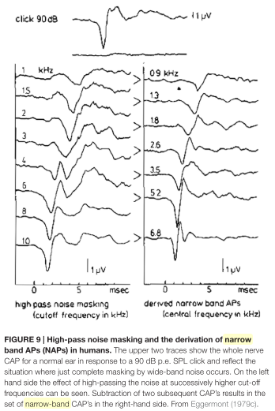
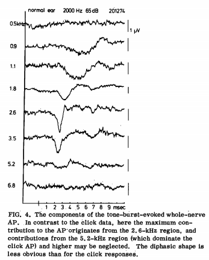
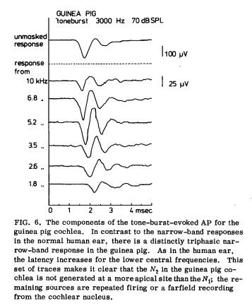
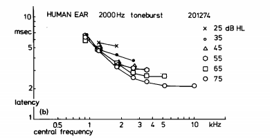
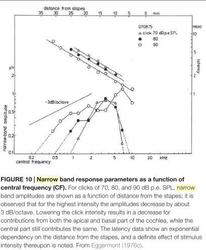
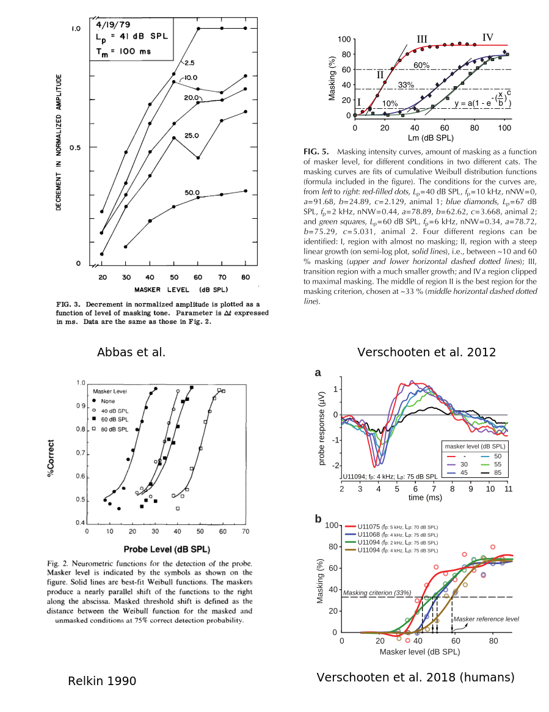

# Elements from previous work

Note: Good review article on CAP  
*Ups and downs in 75 years of electrocochleography* Eggermont [@Eggermont2017].

## The narrow-band contributions to the compound action potential

Masking of a click or tone-burst with a high-passed white noise (NB: not strictly speaking forward masking as the noise was kept during the probe, as far as I understand). The subtraction of the CAP obtained with masking with the previous recording ($f_{cut}$ cut-off frequency decreases at each step) gives the 'narrow-band' contribution of the CAP.

It has been used especially by Eggermont, although not the 1st one to use it (Teas et al., 1962)

* *Analysis of compound action potential responses to tone bursts in the human and guinea pig cochlea* Eggermont 1976 [@Eggermont1976]
  * TT recordings
* *Narrow-band analysis of compound action potentials for several stimulus conditions in the guinea pig* Eggermont 1981

{width=4in}

{width=3in}

\clearpage

Note: He found quite a different pattern for NAP in response to tone bursts in guinea pigs (second negative peak)

{width=3in}

 Seems like we see a broader tuning of auditory filters.

* more frequencies contribute to the CAP
*  also the 'narrow-band analysis' is less frequency selective. In fact, the 'NAPs' do not show exactly the contribution of each frequency band because of the spread of the masker along the cochlear partition (this problem is alleviated in the model I propose because it seeks to estimate this spread with tuning of auditory filters) 

\clearpage

The NAP method was used to estimate the latencies of each frequency contribution:

{width=4in}

(exponential dependency, more visible on this figure for click : )

{width=4in}

\clearpage

## Unit responses, convolution models

* Individual ANF contribution

From Eggermont 2017 (review article):

> Further experimental evidence for the applicability of the NAP technique in pathological cochleas came from recordings in normal and noise-exposed guinea pigs (Versnel et al., 1992), which looked at the validity of using the same unit response along the CF range and in normal vs. hearing loss ears. They used a technique pioneered by Kiang et al. (1976) involving spike-triggered averaging of round window ‘‘noise’’. In that way one can estimate the unit response for units with CFs corresponding to locations along the cochlear partition. Their findings in normal cochleas confirmed the earlier data from Prijs (1986), namely that the unit response was diphasic and had a fairly constant amplitude of about 0.1 µV. In noise-exposed cochleas, waveform, latency and amplitude of the negative component of the unit response remained unchanged.

![Unit response estimated with spike-triggered average, Prijs 1986 [@Prijs1986] ](./figures/unit_response.png){width=3.5in}

Similar to Kiang et al. 1976 [@Kiang1976].  

Other ref: thesis of Wang [@Wang1979]

![Fig 13 [@Wang1979] : averages of URs depending on animal, CF, SR](./figures/URs.png){width=5.5in}

![Fig 14 [@Wang1979] : full average](./figures/UR.png){width=2.5in}

Note: interpretation in terms of finite differences: $\approx \delta - \delta'$ (and possibly second derivative)

\clearpage

* Synchronous fibers contribution

Related to the PST histogram or time distribution of first spike (if 2nd peak negligible)

![Contributions of several ANFs at the onset of a tone. [@Ozdamar1978]](./figures/PST_tone.png){width=5in}

\clearpage

* Double convolution models (or similar)
  * *Synthetic whole-nerve action potentials for the cat* E. de Boer 1975 
    	artifical PST histograms are computed with a filter + envelope + rectifier model, so it seems to go far in the modeling
  * *Deconvolution of compound action potentials and nonlinear features of the PST histogram* [@Bappert1980]

  $$CAP = \underbrace{E \star NPST}_{CPST} \star UR$$

  CAP:Compound action potential  
  E: excitation pattern (in time, does not try to go in the frequency domain using the latencies)  
  NPST: "norm" PST (distribution of spikes for synchronous ANFs)  
  CPST: Compound PST (PST given all the contributions of ANFs)  
  UR: unit response  
  In fact, there is a logarithm transform (dilatation) of the CPST to take into account the exponential shape of latencies wrt frequencies, so it is not strictly speaking a double convolution.

## Forward masking experiments

- *AP responses in forward-masking paradigms and relationship to responses of auditory-nerve fibers* Abbas, JASA 1981  [@Abbas1981]
- Verschooten et al., 2012/2018 [@verschooten2012; @Verschooten2018]
- *Forward masking of the compound action potential: Thresholds for the detection of the N1 peak* Relkin 1990 (deals with detection threshold and % detection only) [@Relkin1991]

* estimation of tuning : Harrison 1981 [@Harrison1981; @Harrison1981a], Verschooten et al.

\clearpage

# Idea

**General idea: ** return to the 'double convolution' model but exploit different forward masking settings to have a more robust model of CAP (and possibly estimate auditory tuning)

$$CAP = \underbrace{E \star NPST}_{CPST} \star UR$$

(notations of [@Bappert1980]). Or:

$$CAP = E \star H$$

where $E$ is the 'excitation pattern' and $H=NPST \star UR$. It's a 'blind deconvolution' problem because we have only a vague idea of what $E$ and $H$ are.

With forward masking, we can get more information. Instead of having a single excitation pattern $E$, we can have several patterns

$$E_i = M_i (\theta) \cdot E_0$$

where $M_i(\theta)$ is a masking pattern depending on the masker (tone, band noise..), and $E_0$ is the raw excitation pattern (without masking). The masking pattern depends on the model parameters $\theta$ which are primarily the latencies and the frequency selectivity (given a simple model of auditory filters). We can compute a theoretical 'masking pattern' thanks to the plot of % masking as a function of masker level for broadband noise, see Fig. \ref{fig:masking} (under certain assumptions, e.g. have to be careful of growth-of-masking).

Then now we have a system of equations with

$$[CAP]_i = [M_i (\theta) \cdot E_0]_i \star H \ .$$

It is still the 'blind deconvolution' problem but we have a stronger prior on the excitation patterns as they belong to a linear subspace parametrized by $E_0$. Simple projection-based algorithms exist in this case [@Yang1994] (this is essentially deconvolution done alternatively on $E$ and $H$ with a projection step between two iterations). Note: prior constraints could be also put on $H$ based on what we know about UR and NPST, but this seems more challenging (maybe as a second step). We can also think of a regularity prior on $E_0$.   
idea: initialize the algorithm with reasonable estimations of $E$ and $H$. At the end of the algorithm, done for each set of parameters $\theta$, we would select the best model minimizing the square error, then see how it behaves compared to real data.

